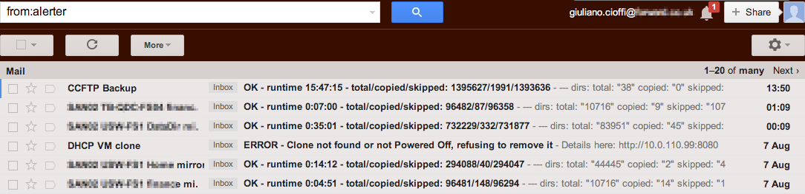
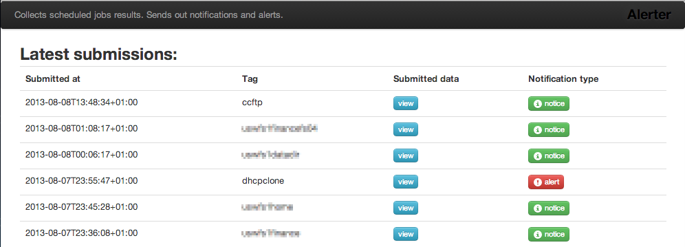
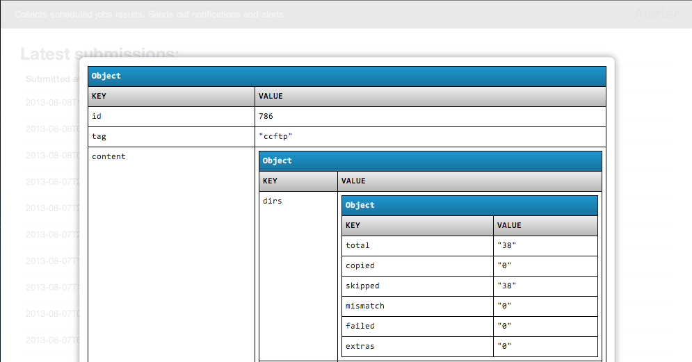

# Alerter

Collects scheduled jobs results. Sends out notifications and alerts.

  - *Submit* something to the server:

        tail whatever.log | curl -s -X PUT http://1.1.1.1:8080/tag/whatever --data-binary @-

  - Receive email notifications about successful/failed/missed job runs.

  - Check the homepage for an historic view about past submissions and their outcome.

Check out the screenshots at the bottom of this readme.

## Notes

Jobs are identified by a `tag`.
Each tag has its own *handler*, which is just a file stored in the `handlers/` directory.
Writing an handler means creating a subclass of `Alerter::Tags::Handlers`, overriding a couple of methods.
Each handler does:

  - Provide configuration data (for both production and developement) such as notification recipients' email addresses.

  - Turn incoming HTTP/PUT data into an instance of the `Submission` class (`DataMapper` model). *Submissions* are stored in the database and provide a field, named `content`, that can hold a generic Ruby object (tipically a hash of hashes with the info you parsed from the PUT request). If `content` has a key named `error`, that means that an alert notification must be generated.

  - Define a schedule (`IceCube::Schedule`), used by the system to detect and notify missed job runs.

  - Provide a `pending` method, which is called periodically (by `cron` or your monitoring system), and it's supposed to take care of the Submissions which didn't generate a notification yet. In this method you generate the email's subject and body.

The only two methods that must be overridden in an Handler subclass are `put` and `pending` (and `initialize`, but that's just to store the email addresses). The name of your class will be the name of the tag.

## Examples

  - `ccftp.rb` is a handler for Robocopy logs. Their "tail" looks like this:

        		Total    Copied   Skipped  Mismatch    FAILED    Extras
             Dirs :        59         0        59         0         0         6
            Files :    119715         1    119714         0         0    927179
            Bytes :235701.102 g         0235701.102 g         0         01723032.823 g
            Times :   9:34:02   0:00:00                       0:00:00   9:34:02
            Ended : Wed Jun 06 20:23:30 2012

  `Ccftp` is derived from a generic `Robocopy` class (see `basetags.rb`) so that adding related alerts is simple.

  - `dhcpclone.rb` is a handler for something like the following (see [this](http://www.108.bz/posts/it/vm-cloning-powershell-script/) blog post):

        start: 20130130-11:37:52
        removing: dhcp-standalone-clone
        cloning: in progress
        done: 20130130-11:51:34

## Screenshots

- What you get in your inbox:

  

- Latest Submissions view:

  

- Clicking on _view_ will pop up a tree representation of the submitted data (uses [prettyPrint](http://james.padolsey.com/javascript/prettyprint-for-javascript/) by James Padolsey):

  

